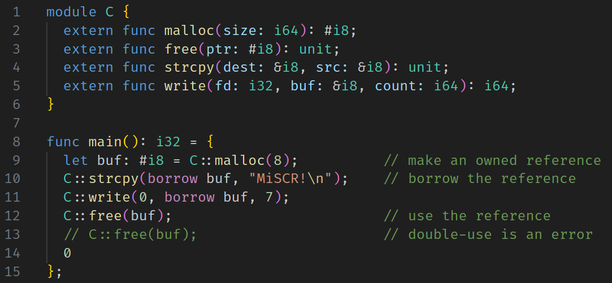

# Minimalist Safe C Replacement (MiSCR)

An aspiring replacement for C/C++ with a minimalist design and pointer safety
powered by a borrow checker.



## Build

MiSCR has minimal dependencies. All you need is
  - LLVM-14 C++ libraries
  - clang++ compiler
  - bash (to run the build script)
  - a few common Unix utilities (echo, rm, basename, dirname)

Here's how to build the compiler:

```shell
./build.sh miscrc
```

There are three build targets in total:
  - `miscrc` -- The MiSCR compiler.
  - `tests` -- Automated unit tests.
  - `playground` -- An interactive testing tool.

Running the build script with no arguments prints a help message.

You can also use `make` to run the build script instead of running it
directly:

```shell
make miscrc
```

## Unit Testing

MiSCR uses a dead-simple test infrastructure (only 50 lines of code!) found
in `src/test/test.hpp`. Building and running tests is this simple:

```shell
./build.sh tests
./tests
```

## Playground

If you want to hack around with the components of the MiSCR compiler, try the
playground! It will read input from stdin and pretty-print internal data
structures such as token vectors and abstract syntax trees.

## MiSCR Language Reference

A MiSCR file (ending in `.miscr`) contains a list of declarations. A
declaration is a module, a `data` type, or a function.

### Module System

A module contains a list of declarations.

```
module CoolMath {
  data Fraction(num: i32, den: i32)

  func mul(r1: Fraction, r2: Fraction): Fraction =
    Fraction(r1.num * r2.num, r1.den * r2.den);
}
```

Decls can be accessed via a path relative to the "current scope" (e.g.,
`CoolMath::mul`).

### References

There are two types of references: borrowed references (denoted with `&`) and
owned references (denoted with `#`).

Let's look at borrowed references first:

    // allocate new stack memory and initialize with value Person("Bob", 42)
    let bobRef: &Person = &Person("Bob", 42);

    // dereference operator
    let bob: Person = bob!;

    // pointer offset calculation
    let ageRef: &i32 = bobRef[.age];

Owned references point to heap-allocated memory that must eventually be freed.
The borrow checker tracks _ownership_ of owned references similar to Rust.
Like Rust, an owned reference cannot be used twice:

    let buf: #i8 = C::malloc(20);
    C::free(buf);
    C::free(buf);            // ERROR: double use.

_Unlike_ Rust, the only things that count as a _use_ are passing the value to
a function or returning it, so MiSCR lets you do things that Rust would complain
about:

    let x: #i8 = C::malloc(20);
    let y: #i8 = x;          // This doesn't use x,
    C::free(x);              // so x is still usable here.

On the second line, ownership of `x` is not transfered to `y`. Instead, `y`
becomes an _alias_ for `x`. (Actually, `x` and `y` are _both_ aliases for an
internal identifier that refers to the value returned by `C::malloc`.)

    let s = C::malloc(6);
    let p = StrPair(s, s);       // allowed, this doesn't use s
    myfunction(p);               // error: s is used twice

If you need to pass a reference to a function without using it, you can `borrow`
the reference instead. `borrow` has the type `#T -> &T` for any type `T`.

    let x: #i8 = C::malloc(10);
    myfunction(borrow x);
    C::free(x);

### The `move` expression

Normally it is illegal to use a reference that was not created in the current
scope. The snippet below illustrates how this can lead to double frees; the
`main` scope, which creates `x`, does not expect `helper` to free it.

    func main(): unit = {
      let x = C::malloc(10);
      helper(&x);
      C::free(x);
    };

    func helper(xRef: &#i8): unit = {
      C::free(xRef!);   // ERROR
    };

But sometimes using an externally created oref is necessary. In such cases,
MiSCR allows an oref to be _moved_ into the current scope as long as the moved
oref is _replaced_ before the scope ends:

    func replaceWithHello(s: &String): unit = {
      C::free(move s[.ptr]);    // OK, but s[.ptr]! must be replaced later
      let newPtr = C::malloc(6);
      C::strcpy(borrow newPtr, "hello");
      s[.ptr] := newPtr;        // replacing s[.ptr]!
      s[.len] := 5;
    };

The `move` expression has the type `&#T -> #T` for any type `T`, so it can be
thought of as a special kind of dereference.

### Data Structures

A simple C-like structure (i.e., a block of memory divided into fields).

    data Person(name: &str, age: i32)

    let bob: Person = Person("Bob", 40);
    let bobsage: i32 = bob.age;

## Access Paths and Borrow Checking

Core to the borrow checker is the concept of an _access path_, which is like an
expression containing a local identifier followed by a sequence of dereferences
and struct projections.

The borrow checker is basically a symbolic executer that uses access paths in
place of real values. At any point during execution, an access path can have
one of four statuses:
  - *neutral* -- The path was created outside the current scope.
  - *unused* -- The path was created in the current scope but hasn't been used.
  - *used* -- The path was created in the current scope and has been used.
  - *moved* -- The path was created outside the current scope and has been
               moved and cannot be referenced again until it is replaced.

Paths begin in neutral or unused and must end in neutral or used by the end of
the scope. They transition between states via three different actions:
  - *use*: unused -> used
  - *move*: neutral -> moved
  - *replace*: moved -> neutral

The analysis performed by the borrow checker is similar to things called
"alias analysis" or "points-to analysis" in academia.

## Safety Properties:

MISCR should guarantee the following safety properties:

* Every malloc-d reference is freed exactly once

MISCR does _not_ guarantee these:

The absence of use-after-frees. There is no lifetime analysis, so borrowed
references are just as unsafe as C pointers. e.g.,

    func main(): i32 = {
      let x: #i8 = C::malloc(10);
      let y: &i8 = borrow x;
      C::free(x);
      C::write(0, y, 10);   // SEGFAULT
    };