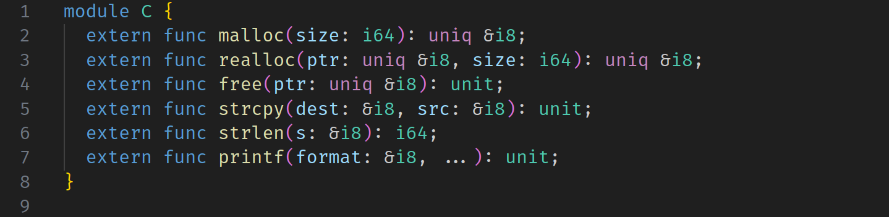
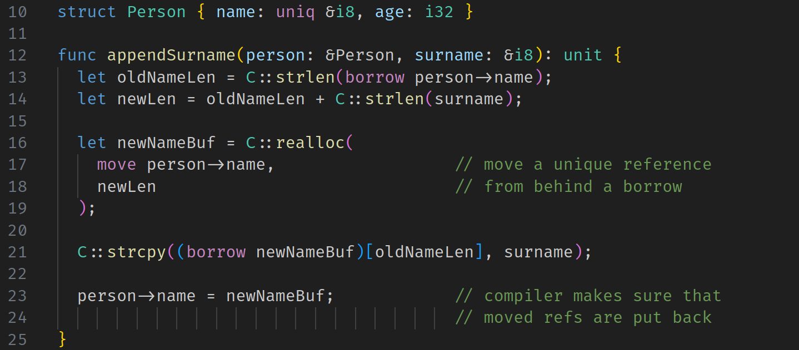

# Minimalist Safe C Replacement (MiSCR)

The _happy medium_ between C/C++ and Rust.




C and C++ are well known to be unsafe languages. Therefore a number of
"C/C++ replacement" languages have been gaining popularity in the last decade
or so such as Rust, Zig, Carbon, and Nim. Of these, Rust is the most popular
and has the most sophisticated tool for enforcing garbage-collector-free memory
safety: the borrow checker. However a common complaint about Rust is that it's
difficult to migrate projects from C++ which could require major code
restructuring. It also has a high learning curve; the phrase "fighting the
borrow checker" is often employed to describe the experience of a Rust newbie.

The main research question of MiSCR is thus: _Is there a middle ground between
the lawlessness of C++ and the strictness of Rust?_ A happy medium where the
design patterns of C++ code can be preserved more or less unchanged while
introducing Rust-inspired memory safety?

## Build the Compiler

The MiSCR tools are written in C++ and use the LLVM libraries. Aside from that,
the only other dependencies are bash and a few common Unix utilities (e.g.,
echo, rm, basename, dirname).

The `build.sh` script should automate the build process in most instances. It
is meant to be readable in case you need to build MiSCR manually. You can also
use `make`.

```shell
# build the MiSCR compiler
./build.sh miscrc
```

Building was tested with:
* Both `g++` and `clang`
* `LLVM-18` libraries

## Run the Compiler

```shell
./miscrc examples/FizzBuzz.miscr
```

The `miscrc` program is really just an LLVM frontend (that is, a MiSCR source
code to LLVM IR translator). If clang is in PATH, then `miscrc` will invoke
clang to compile the generated LLVM to native code. If clang is not in PATH or
if the `--emit-llvm` option is provided, then the backend compilation is
skipped. Clang must be version 15 or higher.

## MiSCR Language Walkthrough

A MiSCR file (ending in `.miscr`) contains a list of declarations. A
declaration is a module, a `data` type, or a function.

### Module System

A module contains a list of declarations.

```
module CoolMath {
  data Fraction(num: i32, den: i32)

  func mul(r1: Fraction, r2: Fraction): Fraction =
    Fraction(r1.num * r2.num, r1.den * r2.den);
}
```

Decls can be accessed via a path relative to the "current scope" (e.g.,
`CoolMath::mul`).

### References

There are two types of references: borrowed references (denoted with `&`) and
unique references (denoted with `&uniq`).

Let's look at borrowed references first:

    // allocate new stack memory and initialize with value Person("Bob", 42)
    let bobRef: &Person = &Person("Bob", 42);

    // dereference operator
    let bob: Person = bob!;

    // address offset calculation
    let ageRef: &i32 = bobRef[.age];

    // field access through reference
    let age: i32 = bobRef->age;

Unique references point to heap-allocated memory that must eventually be freed.
The borrow checker tracks _ownership_ of owned references similar to Rust.
Like Rust, a unique reference cannot be used twice:

    let buf: &uniq i8 = C::malloc(20);
    C::free(buf);
    C::free(buf);            // ERROR: double use.

_Unlike_ Rust, the only things that count as a _use_ are passing the value to
a function or returning it, so MiSCR is slightly more lenient than Rust:

    let x: &uniq i8 = C::malloc(20);
    let y: &uniq i8 = x;     // This doesn't use x,
    C::free(x);              // so x is still usable here.

On the second line, ownership of `x` is not transfered to `y`. Instead, `y`
becomes an _alias_ for `x`. (Actually, `x` and `y` are _both_ aliases for an
internal identifier that refers to the value returned by `C::malloc`.)

    let s = C::malloc(6);
    let p = StrPair(s, s);       // allowed, this doesn't use s
    myfunction(p);               // error: s is used twice

If you need to pass a unique reference to a function without using it, you can
`borrow` the reference instead. `borrow` has the type `&uniq T -> &T` for any
type `T`.

    let x: &uniq i8 = C::malloc(10);
    myfunction(borrow x);
    C::free(x);

### The `move` expression

Normally it is illegal to use a reference that was not created in the current
scope. The snippet below illustrates how this can lead to double frees; the
`main` scope, which creates `x`, does not expect `helper` to free it.

    func main(): unit = {
      let x = C::malloc(10);
      helper(&x);
      C::free(x);
    };

    func helper(xRef: &&uniq i8): unit = {
      C::free(xRef!);   // ERROR
    };

But sometimes using an externally created oref is necessary. In such cases,
MiSCR allows an oref to be _moved_ into the current scope as long as the moved
oref is _replaced_ before the scope ends:

    func replaceWithHello(s: &String): unit = {
      C::free(move s->ptr);     // OK, but s->ptr must be replaced later
      let newPtr = C::malloc(6);
      C::strcpy(borrow newPtr, "hello");
      s[.ptr] := newPtr;        // replacing s->ptr
      s[.len] := 5;
    };

The `move` expression has the type `&uniq T -> &uniq T` for any type `T`.

### Data Structures

A simple C-like structure (i.e., a block of memory divided into fields).

    data Person(name: &str, age: i32)

    let bob: Person = Person("Bob", 40);
    let bobsage: i32 = bob.age;

## Access Paths and Borrow Checking

Core to the borrow checker is the concept of an _access path_, which is like an
expression containing a local identifier followed by a sequence of dereferences
and struct projections.

The borrow checker is basically a symbolic executer that uses access paths in
place of real values. At any point during execution, an access path can have
one of four statuses:
  - *neutral* -- The path was created outside the current scope.
  - *unused* -- The path was created in the current scope but hasn't been used.
  - *used* -- The path was created in the current scope and has been used.
  - *moved* -- The path was created outside the current scope and has been
               moved and cannot be referenced again until it is replaced.

Paths begin in neutral or unused and must end in neutral or used by the end of
the scope. They transition between states via three different actions:
  - *use*: unused -> used
  - *move*: neutral -> moved
  - *replace*: moved -> neutral

The analysis performed by the borrow checker is similar to things called
"alias analysis" or "points-to analysis" in academia.

## Safety Properties:

MiSCR should guarantee that every malloc-ed reference is freed exactly once.

MiSCR does _not_ guarantee the absence of use-after-frees. There is no lifetime
analysis (yet?), so borrowed references are just as unsafe as C pointers. e.g.,

    func main(): i32 = {
      let x: &uniq i8 = C::malloc(10);
      let y: &i8 = borrow x;
      C::free(x);
      C::write(0, y, 10);   // SEGFAULT
    };